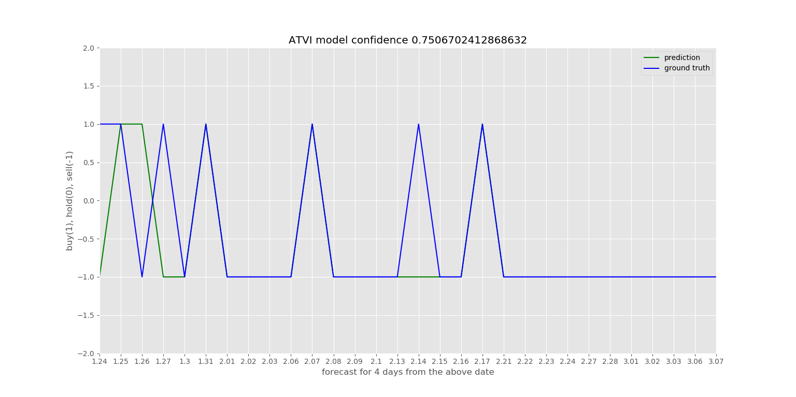

# Stock Market Forcast
Using convolutional neural network to predict the stock market

##Overview
Python script for the Stock Price Prediction. The code uses the [scikit-learn](https://github.com/scikit-learn/scikit-learn) 
machine learning library to train a [support vector regression](https://en.wikipedia.org/wiki/Support_vector_machine) 
on a stock price dataset from [Google Finance](https://en.wikipedia.org/wiki/Support_vector_machine) to estimate a 
buy, hold and sell based on settings.

This project is an attempt to predict the stock volatility using an python finance stock tools. 
In the data set I will explore different observation and normalization schemes.
At the end I will compare the model performance with the benchmarks and discuss issues.

##Dependencies
* numpy (http://www.numpy.org/)
* pandas (http://pandas.pydata.org/)
* csv (https://pypi.python.org/pypi/csv)
* keras (https://keras.io)
* quandl (https://www.quandl.com/tools/python)

##Get started
Once you have your dependencies installed via pip, run the demo script in terminal via
    cd src
    python sklearn_main.py
    
After running the sklearn_main.py you should see the following graph:

    
##Reference 
These links are a good way to learn about some of the dependencies used in this proj
* pandas https://pandas.pydata.org/pandas-docs/stable/whatsnew.html
* pandas-datareader http://pandas-datareader.readthedocs.io/en/latest/remote_data.html#remote-data-quandlquandl

